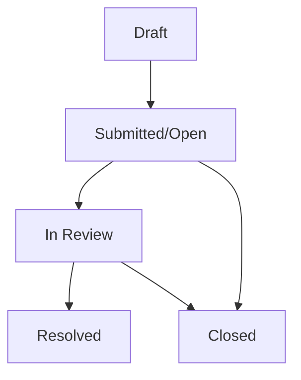

# Feedback Management System Documentation

## Overview

The Feedback Management System in Nyantara provides a comprehensive platform for collecting, managing, and analyzing user feedback on the Direct Benefit Transfer (DBT) system. The system enables beneficiaries to share their experiences, rate services, and provide suggestions for improvement while giving officers tools to track satisfaction and identify areas for enhancement.

## Table of Contents

1. [System Architecture](#system-architecture)
2. [Feedback Collection](#feedback-collection)
3. [Rating System](#rating-system)
4. [Status Workflow](#status-workflow)
5. [Analytics & Reporting](#analytics--reporting)
6. [Data Models](#data-models)
7. [API Integration](#api-integration)
8. [Security & Privacy](#security--privacy)
9. [User Experience](#user-experience)
10. [Officer Dashboard](#officer-dashboard)

## System Architecture

### Core Components

The feedback system consists of three main interfaces:

- **Beneficiary Portal**: Web and mobile applications for submitting feedback
- **Officer Dashboard**: Administrative interface for managing and analyzing feedback
- **Analytics Engine**: Real-time metrics and reporting system

### Technology Stack

```typescript
// Web Application (Next.js + TypeScript)
- Real-time synchronization with Firestore
- Interactive star rating system
- Responsive design with accessibility features
- Multi-language support (English/Hindi)

// Mobile Application (Flutter + Dart)
- Cross-platform feedback submission
- Offline draft capability
- Native rating components
- Provider pattern for state management
```

## Feedback Collection

### Submission Process

The feedback collection system supports multiple input methods:

#### Structured Feedback Form
- **Subject Line**: Brief description of feedback topic
- **Detailed Message**: Comprehensive feedback content
- **Star Rating**: 1-5 star quantitative rating
- **Category Classification**: Automatic categorization based on content

#### Voice Feedback (Future Enhancement)
- **Speech-to-Text**: Voice input for accessibility
- **Audio Recording**: Optional audio feedback storage
- **Transcription Services**: Automated text conversion

### Feedback Categories

```typescript
enum FeedbackCategory {
  GENERAL = 'general',           // General system feedback
  USER_INTERFACE = 'ui',         // UI/UX suggestions
  PERFORMANCE = 'performance',   // System speed and reliability
  FEATURES = 'features',         // Feature requests
  SUPPORT = 'support',           // Customer support experience
  ACCESSIBILITY = 'accessibility' // Accessibility improvements
}
```

### Content Validation

```typescript
const validationRules = {
  subject: {
    required: true,
    minLength: 5,
    maxLength: 100,
    message: 'Subject must be between 5-100 characters'
  },
  message: {
    required: true,
    minLength: 10,
    maxLength: 1000,
    message: 'Message must be between 10-1000 characters'
  },
  rating: {
    required: true,
    minValue: 1,
    maxValue: 5,
    message: 'Please provide a rating between 1-5 stars'
  }
};
```

## Rating System

### Star Rating Implementation

The system uses a 5-star rating scale with the following interpretations:

```typescript
const ratingDefinitions = {
  1: { label: 'Poor', color: '#ef4444', description: 'Major issues requiring immediate attention' },
  2: { label: 'Below Average', color: '#f97316', description: 'Several issues need improvement' },
  3: { label: 'Average', color: '#eab308', description: 'Meets basic expectations' },
  4: { label: 'Good', color: '#22c55e', description: 'Good experience with minor issues' },
  5: { label: 'Excellent', color: '#10b981', description: 'Outstanding experience' }
};
```

### Interactive Rating Component

```tsx
// Web Implementation
const StarRating = ({ value, onChange, readonly = false }) => {
  return (
    <div className="flex gap-1">
      {[1, 2, 3, 4, 5].map((star) => (
        <button
          key={star}
          disabled={readonly}
          onClick={() => onChange(star)}
          className={`text-2xl transition-colors ${
            star <= value ? 'text-yellow-400' : 'text-gray-300'
          }`}
        >
          ★
        </button>
      ))}
    </div>
  );
};
```

### Rating Analytics

```typescript
interface RatingAnalytics {
  averageRating: number;          // Overall average (1-5)
  totalResponses: number;         // Total feedback submissions
  ratingDistribution: {           // Breakdown by star rating
    1: number;
    2: number;
    3: number;
    4: number;
    5: number;
  };
  trendData: {                    // Rating trends over time
    date: string;
    averageRating: number;
    responseCount: number;
  }[];
}
```

## Status Workflow

### Feedback Lifecycle



### Status Definitions

#### Open
- **Initial State**: Feedback submitted but not yet reviewed
- **Actions**: Automatic categorization and priority assignment
- **SLA**: Review within 48 hours for ratings ≤ 2

#### In Review
- **Active State**: Officer assigned and analyzing feedback
- **Features**: Status updates, follow-up questions if needed
- **SLA**: Resolution within 7 days

#### Resolved
- **Completion State**: Feedback addressed with appropriate actions
- **Requirements**: Officer response and action documentation
- **Actions**: Follow-up notification to user

#### Closed
- **Final State**: Feedback lifecycle complete
- **Conditions**: No further action required or user satisfied
- **Retention**: Records maintained for analytics

### Automated Status Management

```typescript
const statusAutomation = {
  // Auto-escalate low ratings
  lowRatingEscalation: (rating: number) => {
    if (rating <= 2) {
      return { status: 'in-review', priority: 'high' };
    }
    return { status: 'open', priority: 'medium' };
  },

  // Auto-close after resolution
  resolutionTimeout: (resolvedDate: Date) => {
    const daysSinceResolution = Date.now() - resolvedDate.getTime();
    if (daysSinceResolution > 30 * 24 * 60 * 60 * 1000) { // 30 days
      return 'closed';
    }
    return 'resolved';
  }
};
```

## Analytics & Reporting

### Key Performance Indicators

```typescript
interface FeedbackKPIs {
  overallSatisfaction: number;     // Average rating across all feedback
  responseRate: number;           // Percentage of feedback with officer responses
  resolutionTime: number;         // Average time to resolve feedback (days)
  trendAnalysis: {               // Month-over-month changes
    satisfactionChange: number;
    volumeChange: number;
    resolutionTimeChange: number;
  };
  categoryBreakdown: Record<string, {
    count: number;
    averageRating: number;
    resolutionRate: number;
  }>;
}
```

### Real-time Dashboard Metrics

#### Satisfaction Overview
- Current average rating
- Rating distribution (1-5 stars)
- Trend over last 30 days
- Comparison with previous periods

#### Volume Analytics
- Total feedback submissions
- Daily/weekly/monthly trends
- Peak submission times
- Geographic distribution

#### Resolution Metrics
- Average resolution time
- Resolution rate by category
- SLA compliance percentage
- Officer performance metrics

### Export Capabilities

```typescript
// CSV Export for Analysis
const exportFeedbackData = async (filters: ExportFilters) => {
  const feedback = await fetchFilteredFeedback(filters);

  const csvData = feedback.map(f => ({
    'Date': formatDate(f.createdAt),
    'Subject': f.subject,
    'Rating': f.rating,
    'Status': f.status,
    'Category': categorizeFeedback(f.message),
    'Resolution Time': calculateResolutionTime(f),
    'Officer Response': f.officerResponse || ''
  }));

  return generateCSV(csvData);
};

// PDF Report Generation
const generateFeedbackReport = async (period: ReportPeriod) => {
  const metrics = await calculateFeedbackMetrics(period);

  const doc = new jsPDF();
  doc.setFontSize(20);
  doc.text('Feedback Analysis Report', 20, 30);

  // Add charts and metrics
  addRatingChart(doc, metrics.ratingDistribution);
  addTrendChart(doc, metrics.trendData);
  addKPISummary(doc, metrics.kpis);

  return doc.save(`feedback-report-${period}.pdf`);
};
```

## Data Models

### Feedback Data Structure

```typescript
interface Feedback {
  id: string;                    // Unique feedback ID
  userId: string;               // Firebase Auth UID of submitter
  subject: string;              // Feedback subject/title
  message: string;              // Detailed feedback content
  rating: number;               // 1-5 star rating
  status: 'open' | 'in-review' | 'resolved' | 'closed';
  category?: string;            // Auto-assigned category
  tags?: string[];              // Additional classification tags
  createdAt: Timestamp;         // Submission timestamp
  updatedAt: Timestamp;         // Last modification timestamp
  resolvedAt?: Timestamp;       // Resolution timestamp
  assignedTo?: string;          // Assigned officer ID
  officerResponse?: string;     // Officer reply/response
  followUpRequired?: boolean;   // Follow-up needed flag
  priority: 'low' | 'medium' | 'high' | 'urgent';
  metadata: {                   // Additional tracking data
    userAgent: string;
    platform: 'web' | 'mobile';
    language: string;
    sessionId: string;
  };
}
```

### Firestore Collections

#### `feedbacks`
- Primary collection for all feedback records
- Real-time listeners for live dashboard updates
- Indexed by `userId`, `status`, `createdAt`, `rating`

#### `feedback_responses`
- Officer responses and internal notes
- Linked to feedback via `feedbackId`
- Audit trail for all communications

## API Integration

### Real-time Synchronization

```typescript
// Firestore real-time listener for user feedback
const useUserFeedback = (userId: string) => {
  useEffect(() => {
    const q = query(
      collection(db, 'feedbacks'),
      where('userId', '==', userId),
      orderBy('createdAt', 'desc')
    );

    const unsubscribe = onSnapshot(q, (snapshot) => {
      const feedback = snapshot.docs.map(doc => ({
        id: doc.id,
        ...doc.data()
      }));
      setFeedback(feedback);
    });

    return unsubscribe;
  }, [userId]);
};

// Officer dashboard listener for all feedback
const useAllFeedback = () => {
  useEffect(() => {
    const q = query(
      collection(db, 'feedbacks'),
      orderBy('createdAt', 'desc')
    );

    const unsubscribe = onSnapshot(q, (snapshot) => {
      const feedback = snapshot.docs.map(doc => ({
        id: doc.id,
        ...doc.data()
      }));
      setAllFeedback(feedback);
    });

    return unsubscribe;
  }, []);
};
```

### CRUD Operations

```typescript
// Submit new feedback
const submitFeedback = async (feedbackData: Partial<Feedback>) => {
  const docRef = await addDoc(collection(db, 'feedbacks'), {
    ...feedbackData,
    createdAt: serverTimestamp(),
    updatedAt: serverTimestamp(),
    status: 'open'
  });
  return docRef.id;
};

// Update feedback status and response
const updateFeedback = async (id: string, updates: Partial<Feedback>) => {
  await updateDoc(doc(db, 'feedbacks', id), {
    ...updates,
    updatedAt: serverTimestamp()
  });
};

// Bulk status updates
const bulkUpdateFeedback = async (ids: string[], status: string) => {
  const batch = writeBatch(db);
  ids.forEach(id => {
    const ref = doc(db, 'feedbacks', id);
    batch.update(ref, {
      status,
      updatedAt: serverTimestamp()
    });
  });
  await batch.commit();
};
```

## Security & Privacy

### Data Protection

- **Encryption**: All feedback data encrypted at rest and in transit
- **Access Control**: Role-based permissions for viewing and managing feedback
- **PII Protection**: User identification masked in public views
- **Audit Trail**: Complete logging of all feedback actions

### Privacy Compliance

- **User Consent**: Explicit consent for feedback collection
- **Data Retention**: Feedback retained for 2 years for analytics
- **Right to Access**: Users can view and delete their own feedback
- **Anonymization**: Personal data removed for aggregate reporting

### Security Measures

```typescript
const securityValidations = {
  // Rate limiting
  checkSubmissionRate: (userId: string) => {
    const recentFeedback = getRecentFeedback(userId, 24); // Last 24 hours
    return recentFeedback.length < 10; // Max 10 feedback per day
  },

  // Content moderation
  moderateContent: (message: string) => {
    const inappropriateWords = ['offensive', 'threatening'];
    return !inappropriateWords.some(word => message.toLowerCase().includes(word));
  },

  // Spam detection
  detectSpam: (feedback: Feedback) => {
    const spamIndicators = [
      message.length < 10,
      repeatedCharacters(message),
      excessiveCaps(message)
    ];
    return spamIndicators.filter(Boolean).length < 2;
  }
};
```

## User Experience

### Submission Interface

#### Web Portal
- Clean, intuitive form design
- Real-time validation feedback
- Progressive enhancement for accessibility
- Multi-step wizard for complex feedback

#### Mobile App
- Native rating components
- Voice input capability
- Offline draft saving
- Push notifications for status updates

### Accessibility Features

```tsx
// Screen reader support
<StarRating
  value={rating}
  onChange={setRating}
  aria-label={`Rate your experience: ${rating} out of 5 stars`}
  role="radiogroup"
/>

// Keyboard navigation
const handleKeyDown = (event: KeyboardEvent, star: number) => {
  if (event.key === 'Enter' || event.key === ' ') {
    event.preventDefault();
    setRating(star);
  }
};
```

### User Dashboard

#### Feedback History
- Chronological list of submitted feedback
- Status tracking for each submission
- Edit capability for open feedback
- Response viewing for resolved items

#### Analytics View
- Personal satisfaction trends
- Response time statistics
- Category breakdown of feedback

## Officer Dashboard

### Feedback Management Interface

#### Queue Management
- Priority-based feedback queue
- Bulk status updates
- Assignment to officers
- SLA monitoring and alerts

#### Response System
- Rich text editor for responses
- Template library for common replies
- Follow-up scheduling
- Resolution documentation

### Advanced Filtering

```typescript
interface FeedbackFilters {
  status?: ('open' | 'in-review' | 'resolved' | 'closed')[];
  rating?: (1 | 2 | 3 | 4 | 5)[];
  priority?: ('low' | 'medium' | 'high' | 'urgent')[];
  category?: string[];
  dateRange?: {
    start: Date;
    end: Date;
  };
  assignedTo?: string;
  searchTerm?: string;
}
```

### Performance Tracking

```typescript
interface OfficerMetrics {
  feedbackAssigned: number;
  feedbackResolved: number;
  averageResponseTime: number;    // Hours
  averageResolutionTime: number;  // Days
  satisfactionScore: number;      // Average rating of resolved feedback
  slaCompliance: number;          // Percentage within SLA
}
```

### Automated Workflows

```typescript
const automatedWorkflows = [
  {
    trigger: 'new_feedback',
    condition: (feedback: Feedback) => feedback.rating <= 2,
    action: () => assignToSeniorOfficer(feedback.id)
  },
  {
    trigger: 'sla_breach',
    condition: (feedback: Feedback) => isSLABreached(feedback),
    action: () => escalateFeedback(feedback.id)
  },
  {
    trigger: 'resolution_complete',
    action: () => sendUserNotification(feedback.id)
  }
];
```

## Integration Points

### Beneficiary Management
- Automatic user identification and verification
- Beneficiary profile linking
- Contact information pre-population

### Grievance System
- Feedback-to-grievance escalation
- Cross-reference linking
- Unified communication thread

### Analytics Platform
- Real-time metric calculations
- Trend analysis and forecasting
- Custom dashboard creation

### Notification System
- Multi-channel notifications (email, SMS, in-app)
- Customizable notification preferences
- Automated reminders and follow-ups

This comprehensive feedback management system ensures continuous improvement of the DBT system by collecting actionable insights from beneficiaries while providing officers with powerful tools to enhance service quality and user satisfaction.