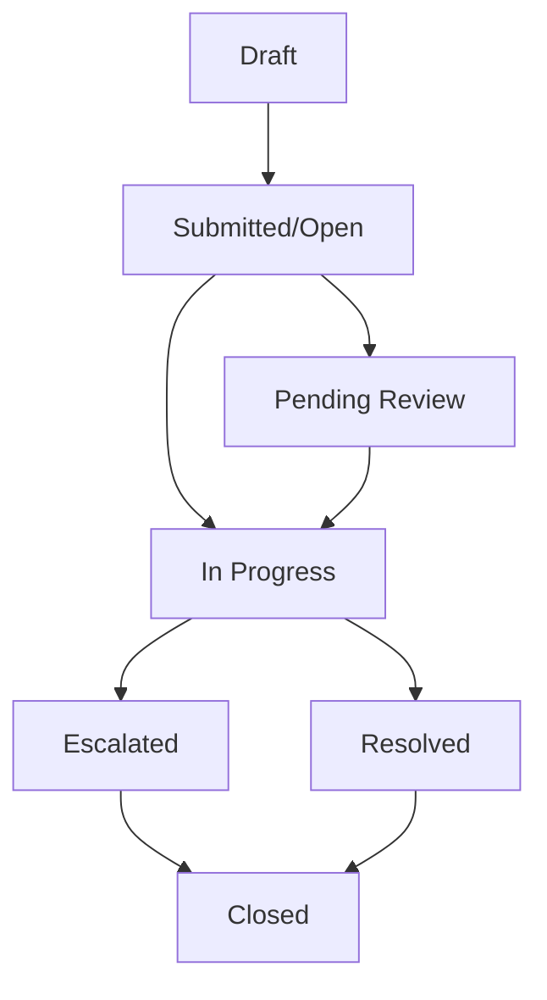

# Grievance Management System Documentation

## Overview

The Grievance Management System in Nyantara provides a comprehensive platform for beneficiaries to report issues, track complaints, and receive timely resolutions. The system supports multi-channel communication, real-time status tracking, and automated escalation workflows to ensure efficient grievance resolution under PCR/PoA Acts.

## Table of Contents

1. [System Architecture](#system-architecture)
2. [Grievance Categories](#grievance-categories)
3. [Status Workflow](#status-workflow)
4. [Priority Classification](#priority-classification)
5. [Communication System](#communication-system)
6. [Escalation Management](#escalation-management)
7. [Data Models](#data-models)
8. [API Integration](#api-integration)
9. [Security & Compliance](#security--compliance)
10. [Reporting & Analytics](#reporting--analytics)

## System Architecture

### Core Components

The grievance system consists of three main interfaces:

- **Beneficiary Portal**: Web and mobile applications for filing grievances
- **Officer Dashboard**: Administrative interface for managing and resolving grievances
- **Communication Engine**: Real-time messaging and voice recognition system

### Technology Stack

```typescript
// Web Application (Next.js + TypeScript)
- Real-time synchronization with Firestore
- Voice recognition using Web Speech API
- Responsive design with Framer Motion animations
- Multi-language support (English/Hindi)

// Mobile Application (Flutter + Dart)
- Cross-platform support (iOS/Android)
- Speech-to-text integration
- Offline capability for grievance drafts
- Provider pattern for state management
```

## Grievance Categories

The system supports six primary grievance categories:

### 1. Disbursement Delay
**Description**: Issues related to delayed or missing payments
**Common Issues**:
- Payment not received after approval
- Incorrect installment amounts
- Bank transfer failures
- UTR number not updated

### 2. Document Issues
**Description**: Problems with document verification or processing
**Common Issues**:
- Document rejection without clear reason
- Missing document requirements
- Verification delays
- Caste certificate validation issues

### 3. Application Status
**Description**: Queries about application processing status
**Common Issues**:
- No status updates
- Application stuck in review
- Missing application acknowledgment
- Timeline exceedances

### 4. Officer Behavior
**Description**: Complaints about officer conduct or service quality
**Common Issues**:
- Unprofessional behavior
- Delayed responses
- Lack of assistance
- Discriminatory treatment

### 5. Information Correction
**Description**: Requests to update beneficiary or application information
**Common Issues**:
- Name/address changes
- Bank account updates
- Contact information corrections
- Category modifications

### 6. Technical Issues
**Description**: Platform-related technical problems
**Common Issues**:
- Login/authentication problems
- Application crashes
- File upload failures
- Notification issues

## Status Workflow

### Grievance Lifecycle



### Status Definitions

#### Open
- **Initial State**: Grievance submitted but not yet assigned
- **Actions**: Auto-assignment based on category and priority
- **SLA**: Assignment within 24 hours for high priority

#### In Progress
- **Active State**: Officer assigned and working on resolution
- **Features**: Regular status updates, communication enabled
- **SLA**: Resolution within 7-14 days based on priority

#### Pending
- **Waiting State**: Awaiting additional information from beneficiary
- **Actions**: Automated reminders, follow-up notifications
- **Timeout**: Auto-escalation after 3 days

#### Escalated
- **Priority State**: Moved to higher authority for resolution
- **Triggers**: SLA breaches, complex issues, repeated complaints
- **Features**: Senior officer assignment, priority processing

#### Resolved
- **Completion State**: Issue addressed and solution implemented
- **Requirements**: Beneficiary confirmation, satisfaction rating
- **Actions**: Follow-up survey, closure documentation

#### Closed
- **Final State**: Grievance lifecycle complete
- **Conditions**: Resolution accepted or maximum escalation reached
- **Retention**: Records maintained for 5 years

## Priority Classification

### Priority Levels

```typescript
enum Priority {
  LOW = 'low',        // General inquiries, non-urgent
  MEDIUM = 'medium',  // Standard processing timeline
  HIGH = 'high',      // Urgent resolution required
  URGENT = 'urgent'   // Immediate attention needed
}
```

### Priority Assignment Logic

```typescript
function calculatePriority(category: string, description: string): Priority {
  // Urgent categories
  if (category === 'officer-behavior') return Priority.URGENT;

  // High priority keywords
  const urgentKeywords = ['emergency', 'life-threatening', 'immediate'];
  if (urgentKeywords.some(keyword => description.includes(keyword))) {
    return Priority.URGENT;
  }

  // Category-based priority
  const highPriorityCategories = ['disbursement-delay', 'document-issues'];
  if (highPriorityCategories.includes(category)) {
    return Priority.HIGH;
  }

  return Priority.MEDIUM;
}
```

### SLA Timelines

| Priority | Assignment | Resolution | Escalation |
|----------|------------|------------|------------|
| Urgent   | 2 hours    | 24 hours   | 12 hours   |
| High     | 4 hours    | 3 days     | 24 hours   |
| Medium   | 24 hours   | 7 days     | 3 days     |
| Low      | 48 hours   | 14 days    | 7 days     |

## Communication System

### Multi-Channel Communication

The system supports multiple communication methods:

#### Text Messaging
- **Real-time Chat**: Instant messaging between beneficiaries and officers
- **Message History**: Complete conversation thread preservation
- **File Attachments**: Support for documents, images, and evidence

#### Voice Recognition
- **Speech-to-Text**: Voice input for grievance descriptions
- **Accessibility**: Support for users with disabilities
- **Multi-language**: Recognition in English and Hindi

#### Automated Notifications
- **Email Alerts**: Status updates and important notifications
- **SMS Notifications**: Critical updates and reminders
- **In-app Notifications**: Real-time status changes

### Communication Data Structure

```typescript
interface CommunicationEntry {
  id: string;
  senderId: string;
  senderType: 'beneficiary' | 'officer' | 'system';
  message: string;
  timestamp: Timestamp;
  attachments?: string[];
  messageType: 'text' | 'voice' | 'system';
  readStatus: boolean;
}
```

### Voice Recognition Implementation

```typescript
// Web Speech API Integration
const recognition = new webkitSpeechRecognition();
recognition.continuous = false;
recognition.interimResults = false;
recognition.lang = currentLanguage; // 'en-US' or 'hi-IN'

recognition.onresult = (event) => {
  const transcript = event.results[0][0].transcript;
  setDescription(transcript);
};
```

## Escalation Management

### Escalation Triggers

1. **SLA Breach**: Automatic escalation when resolution timelines are exceeded
2. **Priority Violations**: High/urgent grievances not addressed timely
3. **Repeated Complaints**: Multiple grievances from same beneficiary
4. **Complex Issues**: Technical or legal issues requiring senior intervention

### Escalation Levels

```typescript
enum EscalationLevel {
  LEVEL_0 = 0,  // Standard processing
  LEVEL_1 = 1,  // Senior officer
  LEVEL_2 = 2,  // Department head
  LEVEL_3 = 3,  // Director level
  LEVEL_4 = 4  // State authority
}
```

### Escalation Workflow

```typescript
function escalateGrievance(grievanceId: string, currentLevel: number): void {
  const newLevel = currentLevel + 1;

  // Update grievance record
  updateDoc(doc(db, 'grievances', grievanceId), {
    escalationLevel: newLevel,
    assignedTo: getEscalationOfficer(newLevel),
    priority: 'urgent',
    lastUpdated: serverTimestamp()
  });

  // Notify relevant parties
  notifyEscalation(grievanceId, newLevel);
}
```

### Auto-Escalation Rules

```typescript
const autoEscalationRules = [
  {
    condition: (daysOpen: number, priority: string) => daysOpen > 7 && priority === 'urgent',
    action: () => escalateToLevel(1)
  },
  {
    condition: (daysOpen: number, priority: string) => daysOpen > 14 && priority === 'high',
    action: () => escalateToLevel(1)
  },
  {
    condition: (escalationLevel: number, daysOpen: number) => escalationLevel >= 2 && daysOpen > 30,
    action: () => escalateToLevel(escalationLevel + 1)
  }
];
```

## Data Models

### Grievance Data Structure

```typescript
interface Grievance {
  id: string;                    // Unique grievance ID (GRV + random number)
  beneficiaryId?: string;        // Linked beneficiary ID
  userId?: string;              // Firebase Auth UID
  beneficiaryName: string;      // Beneficiary full name
  phone?: string;               // Contact phone number
  email?: string;               // Contact email
  district?: string;            // Beneficiary district
  state?: string;               // Beneficiary state
  actType?: string;             // PoA or PCR
  applicationId?: string;       // Related application ID
  category?: string;            // Grievance category
  subCategory?: string;         // Sub-category (optional)
  priority?: string;            // low | medium | high | urgent
  status?: string;              // open | in-progress | resolved | closed | escalated | pending
  assignedTo?: string;          // Assigned officer ID
  assignedDate?: string;        // Assignment timestamp
  createdDate?: string | null;  // Creation timestamp
  lastUpdated?: string;         // Last modification timestamp
  resolutionDate?: string | null; // Resolution timestamp
  expectedResolution?: string;  // Expected resolution date
  description?: string;         // Grievance description
  attachments?: number;         // Number of attachments
  communication?: any[];        // Communication thread
  escalationLevel?: number;     // Escalation level (0-4)
  satisfactionRating?: number | null; // 1-5 star rating
  followUpRequired?: boolean;   // Follow-up needed flag
  relatedGrievances?: string[]; // Related grievance IDs
}
```

### Firestore Collections

#### `grievances`
- Primary collection for all grievance records
- Real-time listeners for live updates
- Indexed by `createdDate`, `status`, `priority`, `assignedTo`

#### `grievance_communications`
- Separate collection for communication threads
- Linked to grievances via `grievanceId`
- Supports file attachments and voice messages

## API Integration

### Real-time Synchronization

```typescript
// Firestore real-time listener
const useGrievances = (userId: string) => {
  useEffect(() => {
    const q = query(
      collection(db, 'grievances'),
      where('userId', '==', userId),
      orderBy('createdDate', 'desc')
    );

    const unsubscribe = onSnapshot(q, (snapshot) => {
      const grievances = snapshot.docs.map(doc => ({
        id: doc.id,
        ...doc.data()
      }));
      setGrievances(grievances);
    });

    return unsubscribe;
  }, [userId]);
};
```

### CRUD Operations

```typescript
// Create new grievance
const createGrievance = async (grievanceData: Partial<Grievance>) => {
  const docRef = await addDoc(collection(db, 'grievances'), {
    ...grievanceData,
    createdDate: serverTimestamp(),
    status: 'open'
  });
  return docRef.id;
};

// Update grievance status
const updateGrievanceStatus = async (id: string, status: string) => {
  await updateDoc(doc(db, 'grievances', id), {
    status,
    lastUpdated: serverTimestamp()
  });
};

// Add communication
const addCommunication = async (grievanceId: string, message: string) => {
  await updateDoc(doc(db, 'grievances', grievanceId), {
    communication: arrayUnion({
      message,
      timestamp: serverTimestamp(),
      senderId: currentUser.uid
    })
  });
};
```

## Security & Compliance

### Data Protection

- **Encryption**: All communication encrypted in transit and at rest
- **Access Control**: Role-based permissions for officers and beneficiaries
- **Audit Trail**: Complete logging of all grievance actions
- **PII Protection**: Sensitive data masked in logs and exports

### Compliance Requirements

- **PCR/PoA Acts**: Compliance with grievance redressal mechanisms
- **Data Retention**: 5-year retention for resolved grievances
- **Right to Information**: Beneficiary access to their grievance records
- **Confidentiality**: Officer notes and internal communications protected

### Security Measures

```typescript
const securityValidations = {
  // Input sanitization
  sanitizeInput: (input: string) => input.replace(/[<>]/g, ''),

  // Rate limiting
  checkRateLimit: (userId: string) => {
    const recentGrievances = getRecentGrievances(userId, 24); // Last 24 hours
    return recentGrievances.length < 5; // Max 5 grievances per day
  },

  // Content filtering
  filterInappropriateContent: (text: string) => {
    const inappropriateWords = ['offensive', 'threatening'];
    return !inappropriateWords.some(word => text.includes(word));
  }
};
```

## Reporting & Analytics

### Key Metrics

```typescript
interface GrievanceMetrics {
  totalGrievances: number;
  openGrievances: number;
  resolvedGrievances: number;
  averageResolutionTime: number; // in days
  satisfactionRate: number;      // percentage
  escalationRate: number;        // percentage
  categoryBreakdown: Record<string, number>;
  priorityBreakdown: Record<string, number>;
  officerPerformance: Record<string, {
    assigned: number;
    resolved: number;
    averageTime: number;
  }>;
}
```

### Dashboard Analytics

#### Real-time Metrics
- Current open grievances count
- Average resolution time
- Escalation trends
- Category distribution

#### Performance Indicators
- Officer resolution rates
- SLA compliance percentages
- Beneficiary satisfaction scores
- Trend analysis over time

### Export Capabilities

```typescript
// PDF Report Generation
const generateGrievanceReport = async (filters: ReportFilters) => {
  const grievances = await fetchFilteredGrievances(filters);

  const doc = new jsPDF();
  autoTable(doc, {
    head: [['ID', 'Beneficiary', 'Category', 'Status', 'Priority', 'Created', 'Resolved']],
    body: grievances.map(g => [
      g.id,
      g.beneficiaryName,
      g.category,
      g.status,
      g.priority,
      formatDate(g.createdDate),
      formatDate(g.resolutionDate)
    ])
  });

  return doc.save('grievance-report.pdf');
};
```

### Automated Alerts

```typescript
const alertRules = [
  {
    condition: (metrics: GrievanceMetrics) => metrics.openGrievances > 100,
    action: () => sendAlert('High grievance backlog', 'urgent')
  },
  {
    condition: (metrics: GrievanceMetrics) => metrics.satisfactionRate < 70,
    action: () => sendAlert('Low satisfaction rate detected', 'high')
  },
  {
    condition: (metrics: GrievanceMetrics) => metrics.escalationRate > 20,
    action: () => sendAlert('High escalation rate', 'medium')
  }
];
```

## Integration Points

### Beneficiary Management
- Automatic beneficiary lookup and validation
- Pre-populated contact information
- Beneficiary history tracking

### Application System
- Link grievances to specific applications
- Application status updates trigger notifications
- Cross-reference with disbursement records

### Officer Dashboard
- Assignment algorithms based on workload and expertise
- Bulk operations for efficient processing
- Performance tracking and reporting

### Notification System
- Multi-channel notifications (email, SMS, in-app)
- Customizable notification preferences
- Automated reminders and follow-ups

This comprehensive grievance management system ensures transparent, efficient, and accountable resolution of beneficiary complaints while maintaining compliance with legal requirements and providing excellent user experience across web and mobile platforms.