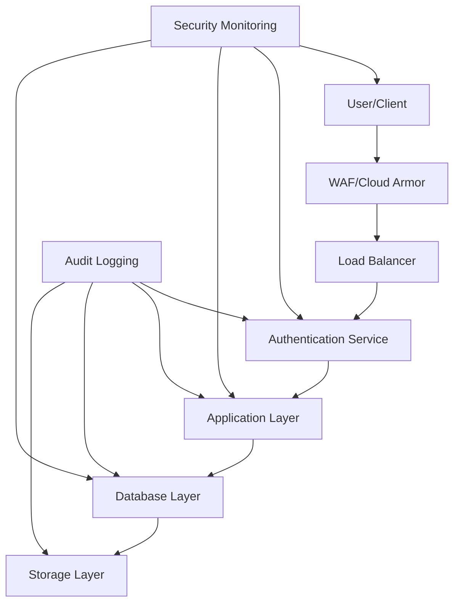
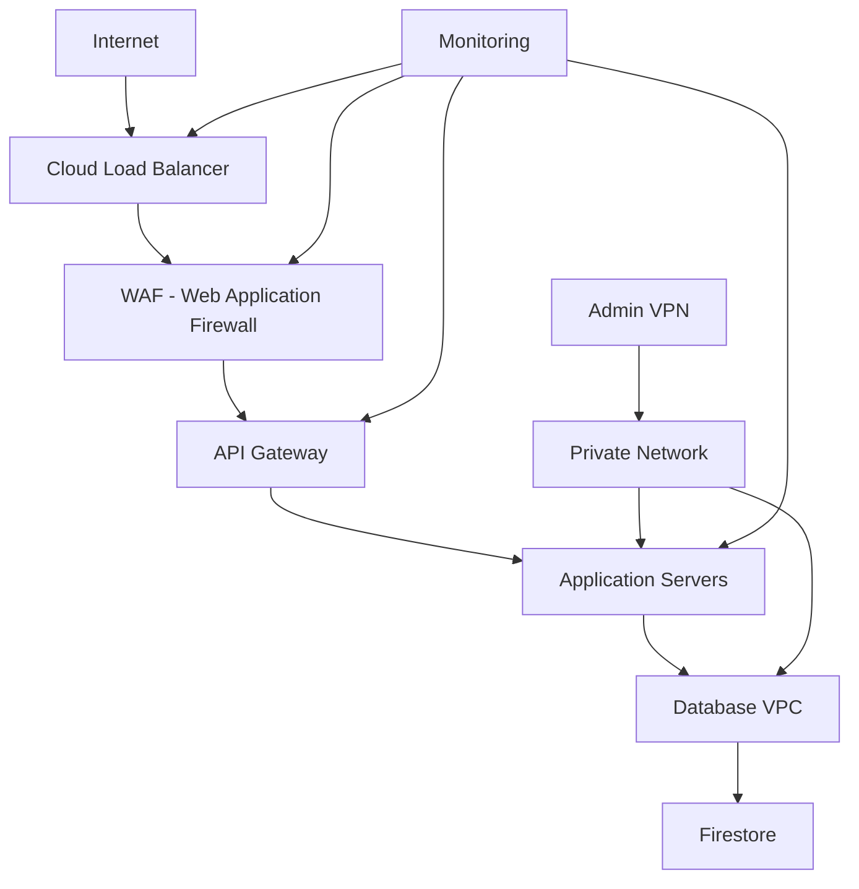
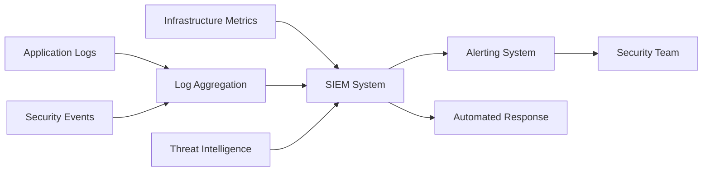

# Security Audit Documentation

## Overview

This document outlines the security measures, audit procedures, and compliance requirements for the Nyantara Direct Benefit Transfer (DBT) management system. The system handles sensitive beneficiary data and financial transactions, requiring robust security controls.

## Table of Contents

1. [Security Architecture](#security-architecture)
2. [Authentication & Authorization](#authentication--authorization)
3. [Data Protection](#data-protection)
4. [Network Security](#network-security)
5. [Application Security](#application-security)
6. [Audit Logging](#audit-logging)
7. [Compliance Requirements](#compliance-requirements)
8. [Security Monitoring](#security-monitoring)
9. [Incident Response](#incident-response)
10. [Security Testing](#security-testing)

## Security Architecture

### Defense in Depth

The system implements multiple layers of security controls:

1. **Perimeter Security**: Network-level protection and access controls
2. **Application Security**: Code-level security measures and input validation
3. **Data Security**: Encryption and access controls for sensitive data
4. **Operational Security**: Secure development practices and monitoring

### Security Components



## Authentication & Authorization

### Authentication Methods

#### Firebase Authentication

```typescript
// Authentication configuration
const authConfig = {
  // Supported providers
  providers: [
    'email/password',
    'phone',
    'google',
    'anonymous' // For public access
  ],

  // Security settings
  security: {
    emailVerification: true,
    passwordPolicy: {
      minLength: 8,
      requireUppercase: true,
      requireLowercase: true,
      requireNumbers: true,
      requireSymbols: false
    },
    sessionTimeout: 24 * 60 * 60 * 1000, // 24 hours
    maxLoginAttempts: 5,
    lockoutDuration: 15 * 60 * 1000 // 15 minutes
  }
};
```

#### Multi-Factor Authentication (MFA)

```typescript
// MFA configuration for high-risk operations
const mfaConfig = {
  requiredFor: [
    'officer_login',
    'admin_operations',
    'payment_approval',
    'data_export'
  ],
  methods: ['sms', 'totp', 'email'],
  gracePeriod: 7 * 24 * 60 * 60 * 1000 // 7 days
};
```

### Authorization Model

#### Role-Based Access Control (RBAC)

```typescript
interface RolePermissions {
  junior_officer: {
    beneficiaries: ['read', 'create', 'update'],
    applications: ['read', 'create', 'update', 'approve'],
    disbursements: ['read'],
    grievances: ['read', 'update', 'resolve'],
    reports: ['read']
  },

  senior_officer: {
    // Inherits junior_officer permissions
    ...junior_officer,
    disbursements: ['read', 'create', 'approve'],
    officers: ['read'],
    analytics: ['read']
  },

  admin: {
    // Full access to all resources
    '*': ['*']
  }
}
```

#### Attribute-Based Access Control (ABAC)

```typescript
// ABAC policies for fine-grained access
const abacPolicies = [
  {
    name: 'district_access',
    condition: 'user.assignedDistricts.includes(resource.district)',
    effect: 'allow'
  },
  {
    name: 'application_status_access',
    condition: 'user.role === "junior_officer" && resource.status !== "approved"',
    effect: 'allow'
  },
  {
    name: 'payment_amount_limit',
    condition: 'user.role === "junior_officer" && resource.amount <= 50000',
    effect: 'allow'
  }
];
```

## Data Protection

### Data Classification

| Classification | Examples | Protection Level |
|----------------|----------|------------------|
| **Public** | Application forms, help documents | Basic access controls |
| **Internal** | Officer reports, analytics | Authentication required |
| **Confidential** | Beneficiary personal data | Encryption + access controls |
| **Restricted** | Financial data, Aadhaar numbers | Highest security controls |

### Encryption Standards

#### At Rest Encryption

```typescript
// Firestore field-level encryption
const encryptedFields = [
  'aadhaarNumber',
  'bankDetails.accountNumber',
  'phone',
  'emergencyContact.phone'
];

// Encryption configuration
const encryptionConfig = {
  algorithm: 'AES-256-GCM',
  keyRotation: 90 * 24 * 60 * 60 * 1000, // 90 days
  keyManagement: 'Cloud KMS',
  backupEncryption: true
};
```

#### In Transit Encryption

- **TLS 1.3** for all web communications
- **Certificate pinning** for mobile applications
- **VPN** for administrative access
- **IPsec** for inter-service communications

### Data Masking

```typescript
// Data masking rules
const maskingRules = {
  aadhaar: (value: string) => value.replace(/^(\d{4})\d{4}(\d{4})$/, '$1****$2'),
  phone: (value: string) => value.replace(/^(\+\d{2})\d{6}(\d{4})$/, '$1******$2'),
  accountNumber: (value: string) => value.replace(/^(\d{4})\d{8}(\d{4})$/, '$1********$2')
};
```

## Network Security

### Network Architecture



### Firewall Configuration

#### Cloud Armor Policies

```yaml
# Web Application Firewall rules
wafRules:
  - name: sql_injection_protection
    action: deny
    priority: 1000
    match:
      expr: |
        has(request.headers['user-agent']) &&
        request.headers['user-agent'].contains('sqlmap')

  - name: rate_limiting
    action: throttle
    priority: 2000
    rateLimitOptions:
      conformAction: allow
      exceedAction: deny
      rateLimitThreshold:
        count: 100
        intervalSec: 60

  - name: geo_blocking
    action: deny
    priority: 3000
    match:
      expr: |
        origin.region_code in ['CN', 'RU', 'KP']
```

### DDoS Protection

- **Cloud Armor Adaptive Protection**: Automatic DDoS mitigation
- **Rate Limiting**: API rate limits per user/IP
- **Bot Management**: reCAPTCHA integration
- **Traffic Shaping**: Request throttling based on patterns

## Application Security

### Input Validation

```typescript
// Input validation schemas
const validationSchemas = {
  beneficiary: Joi.object({
    name: Joi.string().min(2).max(100).required(),
    aadhaarNumber: Joi.string().pattern(/^\d{12}$/).required(),
    phone: Joi.string().pattern(/^\+91-\d{10}$/).required(),
    dateOfBirth: Joi.date().max('now').required()
  }),

  application: Joi.object({
    actType: Joi.string().valid('PoA', 'MGNREGA', 'PDS').required(),
    requestedAmount: Joi.number().min(1).max(100000).required(),
    documents: Joi.array().items(
      Joi.object({
        type: Joi.string().required(),
        url: Joi.string().uri().required()
      })
    ).min(1).required()
  })
};
```

### Secure Coding Practices

#### OWASP Top 10 Mitigation

| Vulnerability | Mitigation Strategy |
|---------------|-------------------|
| **Injection** | Parameterized queries, input sanitization |
| **Broken Authentication** | MFA, secure session management |
| **Sensitive Data Exposure** | Encryption, secure key management |
| **XML External Entities** | Disable XML parsers, input validation |
| **Broken Access Control** | RBAC, ABAC, regular permission audits |
| **Security Misconfiguration** | Automated configuration scanning |
| **Cross-Site Scripting** | Content Security Policy, output encoding |
| **Insecure Deserialization** | Input validation, secure parsers |
| **Vulnerable Components** | Dependency scanning, regular updates |
| **Insufficient Logging** | Comprehensive audit logging |

### API Security

```typescript
// API security middleware
const apiSecurity = {
  cors: {
    origin: process.env.ALLOWED_ORIGINS?.split(','),
    credentials: true,
    methods: ['GET', 'POST', 'PUT', 'DELETE'],
    allowedHeaders: ['Content-Type', 'Authorization', 'X-API-Key']
  },

  helmet: {
    contentSecurityPolicy: {
      directives: {
        defaultSrc: ["'self'"],
        scriptSrc: ["'self'", "'unsafe-inline'"],
        styleSrc: ["'self'", "'unsafe-inline'"],
        imgSrc: ["'self'", 'data:', 'https:'],
        fontSrc: ["'self'"]
      }
    },
    hsts: { maxAge: 31536000, includeSubDomains: true },
    noSniff: true,
    xssFilter: true
  },

  rateLimit: {
    windowMs: 15 * 60 * 1000, // 15 minutes
    max: 100, // limit each IP to 100 requests per windowMs
    message: 'Too many requests from this IP, please try again later.'
  }
};
```

## Audit Logging

### Audit Log Structure

```typescript
interface AuditLog {
  id: string;
  timestamp: Timestamp;
  userId: string;
  userType: 'beneficiary' | 'officer' | 'system';
  action: string;
  resource: string;
  resourceId: string;
  changes: Array<{
    field: string;
    oldValue?: any;
    newValue?: any;
  }>;
  ipAddress: string;
  userAgent: string;
  sessionId: string;
  metadata: Record<string, any>;
  riskLevel: 'low' | 'medium' | 'high' | 'critical';
}
```

### Audit Events

#### Critical Events (Always Logged)

```typescript
const criticalEvents = [
  'beneficiary.create',
  'beneficiary.update_sensitive',
  'application.approve',
  'disbursement.create',
  'officer.role_change',
  'admin.login',
  'data.export',
  'security.incident'
];
```

#### Business Events (Conditionally Logged)

```typescript
const businessEvents = [
  'application.submit',
  'grievance.create',
  'feedback.submit',
  'officer.assign',
  'report.generate'
];
```

### Log Retention

```typescript
const logRetention = {
  audit_logs: {
    retention: 7 * 365 * 24 * 60 * 60 * 1000, // 7 years
    storage: 'cold_storage',
    encryption: 'AES-256'
  },
  security_logs: {
    retention: 10 * 365 * 24 * 60 * 60 * 1000, // 10 years
    storage: 'secure_vault',
    encryption: 'AES-256'
  },
  access_logs: {
    retention: 2 * 365 * 24 * 60 * 60 * 1000, // 2 years
    storage: 'hot_storage',
    encryption: 'AES-256'
  }
};
```

## Compliance Requirements

### Legal Compliance

#### Data Protection Laws

- **PDPA 2023** (India): Personal data protection
- **IT Act 2000**: Information technology regulations
- **RBI Guidelines**: Banking and financial regulations

#### Industry Standards

- **ISO 27001**: Information security management
- **SOC 2 Type II**: Trust services criteria
- **PCI DSS**: Payment card industry standards (if applicable)

### Regulatory Requirements

#### Aadhaar Compliance

```typescript
const aadhaarCompliance = {
  encryption: 'AES-256-GCM',
  access_control: 'role_based',
  audit_trail: 'comprehensive',
  data_retention: 'minimum_required',
  consent_management: 'explicit_opt_in',
  breach_notification: 'within_72_hours'
};
```

#### Financial Data Handling

```typescript
const financialCompliance = {
  encryption: 'AES-256',
  transaction_logging: 'all_operations',
  reconciliation: 'daily',
  fraud_detection: 'real_time',
  regulatory_reporting: 'monthly',
  audit_trail: 'immutable'
};
```

## Security Monitoring

### Monitoring Components



### Security Metrics

#### Key Performance Indicators

```typescript
const securityKPIs = {
  authentication: {
    failedLoginAttempts: 'count',
    successfulLogins: 'count',
    mfaAdoption: 'percentage',
    sessionTimeouts: 'count'
  },

  authorization: {
    accessDeniedEvents: 'count',
    privilegeEscalationAttempts: 'count',
    roleChanges: 'count'
  },

  dataProtection: {
    encryptionFailures: 'count',
    dataLeakageIncidents: 'count',
    backupSuccessRate: 'percentage'
  },

  networkSecurity: {
    blockedAttacks: 'count',
    ddosIncidents: 'count',
    firewallDenies: 'count'
  }
};
```

### Alerting Rules

```typescript
const alertingRules = [
  {
    name: 'multiple_failed_logins',
    condition: 'failed_login_attempts > 5 within 15 minutes',
    severity: 'medium',
    action: 'alert_security_team'
  },
  {
    name: 'unauthorized_access_attempt',
    condition: 'access_denied && user_role != "admin"',
    severity: 'high',
    action: 'immediate_alert'
  },
  {
    name: 'data_export_attempt',
    condition: 'action == "data_export" && user_role != "admin"',
    severity: 'critical',
    action: 'block_and_alert'
  },
  {
    name: 'suspicious_transaction_pattern',
    condition: 'transaction_amount > 100000 && unusual_location',
    severity: 'high',
    action: 'flag_for_review'
  }
];
```

## Incident Response

### Incident Response Plan

#### Phase 1: Detection & Assessment

```typescript
const incidentDetection = {
  automated_detection: [
    'anomaly_detection',
    'signature_based_detection',
    'behavioral_analysis'
  ],

  manual_detection: [
    'user_reports',
    'security_monitoring',
    'log_analysis'
  ],

  assessment_criteria: {
    severity_levels: ['low', 'medium', 'high', 'critical'],
    impact_areas: ['confidentiality', 'integrity', 'availability'],
    business_impact: ['minimal', 'moderate', 'significant', 'severe']
  }
};
```

#### Phase 2: Containment

```typescript
const containmentStrategies = {
  immediate: [
    'isolate_affected_systems',
    'block_suspicious_ips',
    'revoke_compromised_credentials',
    'enable_additional_monitoring'
  ],

  short_term: [
    'implement_workarounds',
    'deploy_security_patches',
    'strengthen_access_controls',
    'setup_backup_systems'
  ]
};
```

#### Phase 3: Eradication & Recovery

```typescript
const recoveryProcedures = {
  system_recovery: [
    'clean_infected_systems',
    'restore_from_backups',
    'apply_security_updates',
    'validate_system_integrity'
  ],

  data_recovery: [
    'assess_data_damage',
    'restore_encrypted_backups',
    'verify_data_integrity',
    'notify_affected_parties'
  ]
};
```

#### Phase 4: Lessons Learned

```typescript
const postIncidentReview = {
  documentation: [
    'incident_timeline',
    'root_cause_analysis',
    'impact_assessment',
    'response_effectiveness'
  ],

  improvements: [
    'update_security_controls',
    'enhance_monitoring',
    'revise_response_plan',
    'conduct_training'
  ]
};
```

### Communication Plan

```typescript
const communicationPlan = {
  internal_communication: {
    security_team: 'immediate',
    management: 'within_1_hour',
    development_team: 'within_4_hours',
    all_staff: 'within_24_hours'
  },

  external_communication: {
    regulatory_bodies: 'as_required_by_law',
    affected_users: 'within_72_hours',
    media: 'as_approved_by_management',
    public: 'through_official_channels'
  }
};
```

## Security Testing

### Testing Methodology

#### Vulnerability Assessment

```typescript
const vulnerabilityScanning = {
  frequency: 'weekly',
  scope: 'all_public_endpoints',
  tools: ['Nessus', 'OpenVAS', 'Qualys'],
  coverage: {
    web_application: true,
    api_endpoints: true,
    mobile_application: true,
    infrastructure: true
  }
};
```

#### Penetration Testing

```typescript
const penetrationTesting = {
  frequency: 'quarterly',
  methodology: 'OWASP_Testing_Guide',
  scope: {
    black_box: ['external_interfaces'],
    white_box: ['source_code_review'],
    gray_box: ['authenticated_testing']
  },
  tools: ['Burp Suite', 'OWASP ZAP', 'Metasploit']
};
```

### Security Code Review

```typescript
const codeReviewChecklist = [
  'input_validation',
  'authentication_checks',
  'authorization_verification',
  'session_management',
  'error_handling',
  'logging_security',
  'cryptography_usage',
  'access_control',
  'data_protection',
  'secure_configuration'
];
```

### Compliance Audits

#### Internal Audits

```typescript
const internalAudits = {
  frequency: 'monthly',
  scope: 'all_security_controls',
  checklist: [
    'access_control_review',
    'data_classification_audit',
    'encryption_verification',
    'log_review',
    'incident_response_drill'
  ]
};
```

#### External Audits

```typescript
const externalAudits = {
  frequency: 'annually',
  auditors: 'certified_third_party',
  standards: ['ISO_27001', 'SOC_2', 'PDPA_Compliance'],
  deliverables: [
    'audit_report',
    'compliance_certificate',
    'remediation_plan',
    'gap_analysis'
  ]
};
```

### Security Training

```typescript
const securityTraining = {
  frequency: 'quarterly',
  mandatory_for: ['all_employees', 'contractors'],
  topics: [
    'security_awareness',
    'phishing_recognition',
    'password_security',
    'data_handling',
    'incident_reporting'
  ],
  certification: 'required_annually'
};
```

This comprehensive security audit documentation ensures the Nyantara DBT system maintains the highest standards of security, compliance, and data protection for sensitive beneficiary information and financial transactions.